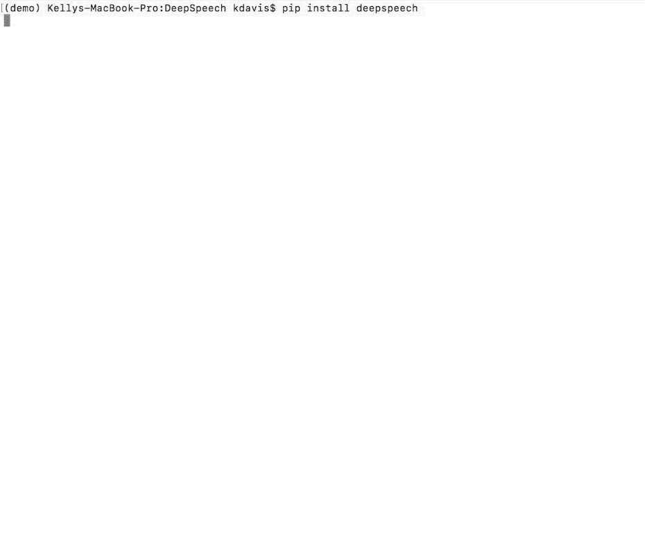

```{r setup, include=FALSE}
library(tidyverse)
library(gghighlight)
library(reports)
knitr::opts_chunk$set(echo = FALSE)
```

```{r message=FALSE, warning=FALSE, include=FALSE}
transcriptions <- read_csv("../data/transcriptions.csv")
transcript_data <- read_csv("../data/transcript_data.csv")
```

# Tēnā Koutou

## Ko wai au? / Who am I?

- Data Scientist at Dragonfly Data Science in Wellington
- Postgraduate Diploma in Pure Mathematics
- Interests in data science: esp. Machine Learning + NLP
- Currently working on Speech to Text in Te Reo Maori
- Used to work on Confidentiality and Environmental Accounts at Stats NZ

# Speech to text in Te Reo Māori 

## Mozilla DeepSpeech

```{r, out.height = "600px"}

```

## 

From [their github](https://github.com/mozilla/DeepSpeech):

```{r, out.width="800px"}
knitr::include_graphics("images/DeepSpeech-header.png")
```

DeepSpeech requires the following to run:

- an alphabet
- a trained model graph
- a trained language model 

```{bash echo=FALSE, eval=FALSE}
./deepspeech --model models/output_graph.pbmm \
  --alphabet models/alphabet.txt \
  --lm models/lm.binary \
  --trie models/trie \
  --audio audio_input.wav
```

## Training a model

Training a model required the following:

- a pipeline to download audio from the [Corpora API](https://github.com/tehikumedia/corpora)
- splitting the recordings into: train, test and dev sets
- a corpus of text to build a language model
- a `p3.8xlarge` cloud compute instance on Amazon Web Services

Dragonfly also made use of our Continuous Integration System, Gorbachev to:

- log the inputs and hyperparameters of each model run
- observe the progress of the model as it trains

## Heldout sets

```{r message=FALSE, warning=FALSE}
transcript_data %>% 
  group_by(approved_set, heldout_set) %>% 
  count() %>% 
  ggplot(aes(x = CA(heldout_set), y = n)) +
  geom_bar(aes(fill = approved_set),
           stat = 'identity') +
  geom_text(aes(label = format(n, big.mark=",")), 
            stat = 'identity', vjust = -0.5) +
  facet_wrap(~CA(approved_set)) +
  guides(fill = FALSE) +
  xlab("Heldout set") +
  ylab("Count") +
  theme_minimal()
```


## Training progress

We were able to visualise the model performance as it trained.

```{r out.width=750}
knitr::include_graphics("images/tensorboard.png")
```

The training was stopped after 10 epochs passed with no significant progress.

## Training results

```{r message=FALSE, warning=FALSE}
transcriptions %>% 
  group_by(approved_set, heldout_set) %>% 
  summarise(word_error_rate = mean(word_error_rate) * 100) %>%  
  ungroup() %>% 
  filter(heldout_set == "Both") %>% 
  mutate(approved_set = map_chr(approved_set, CA)) %>% 
  ggplot(aes(x = approved_set, y = word_error_rate, fill = heldout_set)) +
  geom_bar(stat = 'identity') +
  gghighlight(approved_set == 'Human Approved') + 
  geom_text(aes(label = sprintf("%.1f%%", word_error_rate)),
            stat = 'identity', vjust = -0.5) +
  guides(fill = FALSE) +
  ylab("Word Error Rate") +
  xlab("Heldout Set") +
  theme_minimal()
```

## Training results

```{r message=FALSE, warning=FALSE}
transcriptions %>% 
  group_by(approved_set, heldout_set) %>% 
  summarise(word_error_rate = mean(word_error_rate) * 100) %>%  
  ungroup() %>% 
  filter(heldout_set == "Both") %>% 
  mutate(approved_set = map_chr(approved_set, CA)) %>% 
  ggplot(aes(x = approved_set, y = word_error_rate, fill = heldout_set)) +
  geom_bar(stat = 'identity') +
  geom_text(aes(label = sprintf("%.1f%%", word_error_rate)),
            stat = 'identity', vjust = -0.5) +
  guides(fill = FALSE) +
  ylab("Word Error Rate") +
  xlab("Heldout Set") +
  theme_minimal()
```

## Training results

```{r message=FALSE, warning=FALSE}
transcriptions %>% 
  group_by(approved_set, heldout_set) %>% 
  summarise(word_error_rate = mean(word_error_rate) * 100) %>%  
  ggplot(aes(x = heldout_set, y = word_error_rate, fill = heldout_set)) +
  geom_bar(stat = 'identity') +
  geom_text(aes(label = sprintf("%.1f%%", word_error_rate)),
            stat = 'identity', vjust = -0.5) +
  facet_wrap(~approved_set) +
  guides(fill = FALSE) +
  ylab("Word Error Rate") +
  xlab("Heldout Set") +
  theme_minimal()
```

## Training results

```{r message=FALSE, warning=FALSE}
transcriptions %>% 
  select(approved_set, levenshtein_distance) %>% 
  filter(levenshtein_distance < 30) %>%
  gather(levenshtein_distance, key = "metric", value = "distance") %>% 
  mutate(metric = CA(str_replace(metric, "_", " "))) %>% 
  arrange(approved_set, metric) %>% 
  group_by(approved_set, metric, distance) %>% 
  count() %>% 
  ggplot(aes(x = distance, y = n, colour = approved_set)) +
  geom_point() +
  geom_smooth(aes(fill = approved_set), method = 'lm') +
  scale_y_log10() +
  xlab("Levenshtein Distance") +
  ylab("Log(Frequency)") +
  theme_minimal()
```

## Examples

Here are some texts which were transcribed perfectly:

```{r}
set.seed(1234)
transcriptions %>% 
  filter(transcription == normalized_transcript) %>% 
  select(recording_id, transcription) %>% 
  sample_n(6) %>% 
  knitr::kable()
```

## Examples

Here are some texts which were not transcribed perfectly:

```{r}
set.seed(1234)
transcriptions %>% 
  filter(transcription != normalized_transcript) %>% 
  select(recording_id, normalized_transcript, transcription) %>% 
  sample_n(4) %>% 
  knitr::kable()
```

## Thank you


