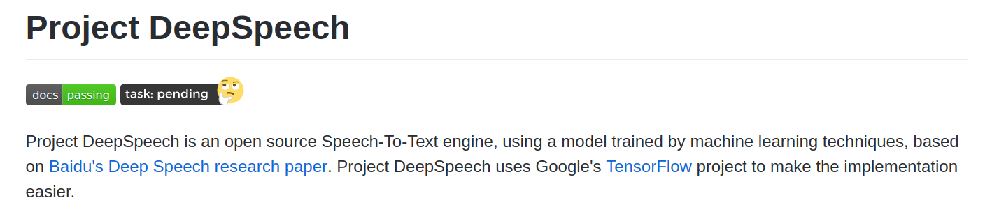
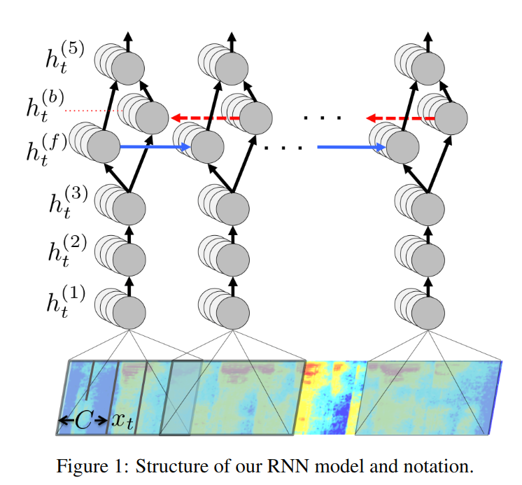
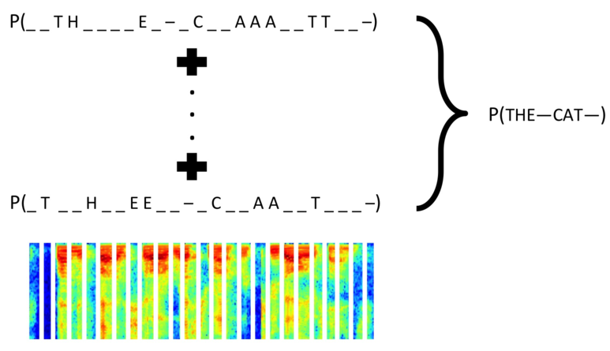
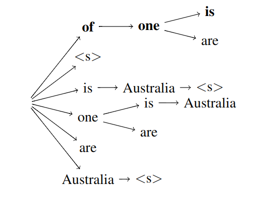
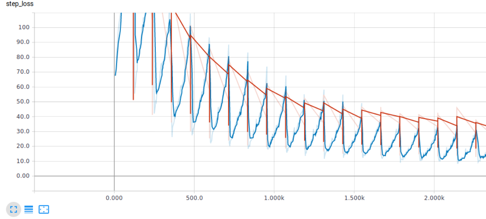

```{r setup, include=FALSE}
library(tidyverse)
library(gghighlight)
library(reports)
knitr::opts_chunk$set(echo = FALSE, message=FALSE, warning=FALSE)
```

```{r message=FALSE, warning=FALSE, include=FALSE}
transcriptions <- read_csv("../data/transcriptions.csv")
transcript_data <- read_csv("../data/transcript_data.csv")
```

# The team

## 

```{r echo=FALSE}
library(png)
library(jpeg)
library(grid)
library(gridExtra)
img1 <-  rasterGrob(as.raster(readPNG("images/te-hiku-logo.png")), interpolate = FALSE)
img2 <-  rasterGrob(as.raster(readJPEG("images/ka-hao-logo.jpeg")), interpolate = FALSE)
img3 <-  rasterGrob(as.raster(readPNG("images/dragonfly-logo-rgb.png")), interpolate = FALSE)
grid.arrange(img1, img2, img3, ncol = 2)
```

## Dragonfly Team

- Edward Abraham
- Miles Thompson
- Douglas Bagnall
- Caleb Moses
- Hamish MacKenzie

## The data

The model was trained on a collection of around 192,000 audio recordings collected from the Korero Maori website.

Efforts were made to manually review the recordings to see which recordings were pronounced accurately. 

In the end, Te Hiku oversaw the manual approval of around 27,000 recordings (about 52 hours).

We trained 3 models over the course of the project, and successive models were used to approve more recordings. In the end, we machine approved an additional 97000 recordings (around 190 hours)

## Mozilla DeepSpeech

From [their github](https://github.com/mozilla/DeepSpeech):

```{r, out.width="800px"}

```

## Model architecture

DeepSpeech works using the following:

- Raw audio broken into 20ms chunks
- Mel-Frequency Cepstrum Encoding of each chunk
- Deep Recurrent Neural Network
- Character probability outputs
- Connectionist Temporal Classification (CTC) compacts the stream of characters
- Language model selects likely sequence of words as output 

## Mel-Frequency Cepstrum Encoding

```{r, out.height="500px"}
img1 <-  rasterGrob(as.raster(readPNG("images/mfcc-block-diagram.png")), interpolate = FALSE)
img2 <-  rasterGrob(as.raster(readPNG("images/mel-scale-filter-bank.png")), interpolate = FALSE)
grid.arrange(img1, img2, ncol = 1)
```

## Deep Recurrent Neural Network

```{r out.height="500px", out.width="500px", fig.align="center"}

```

## Connectionist Temporal Classification

```{r out.height="500px", out.width="700px", fig.align="center"}

```

## KenLM Language Model

```{r out.height="500px", out.width="600px", fig.align="center"}
# Kenneth Heafield

```

## Running inference

DeepSpeech requires the following to run:

- an alphabet
- a trained model graph
- a trained language model

```{bash, eval = FALSE, echo = TRUE}
# An example inference
./deepspeech --model models/output_graph.pbmm \
  --alphabet models/alphabet.txt \
  --lm models/lm.binary \
  --trie models/trie \
  --audio audio_input.wav
```

## Training a model

Training a model required the following:

- a pipeline to download audio from the [Corpora API](https://github.com/tehikumedia/corpora)
- splitting the recordings into: train, test and dev sets
- a corpus of text to build a language model
- a large GPU enabled cloud compute instance on Amazon Web Services

Dragonfly also made use of our Continuous Integration System, Gorbachev to:

- log the inputs and hyperparameters of each model run
- observe the progress of the model as it trains

## Heldout sets

```{r message=FALSE, warning=FALSE}
transcript_data %>% 
  group_by(approved_set, heldout_set) %>% 
  count() %>% 
  ggplot(aes(x = CA(heldout_set), y = n)) +
  geom_bar(aes(fill = approved_set),
           stat = 'identity') +
  geom_text(aes(label = format(n, big.mark=",")), 
            stat = 'identity', vjust = -0.5) +
  facet_wrap(~CA(approved_set)) +
  guides(fill = FALSE) +
  xlab("Heldout set") +
  ylab("Count") +
  theme_minimal()
```


## Training progress

We were able to visualise the model performance as it trained.

```{r out.width=750}

```

The training was stopped after 10 epochs passed with no significant progress.

## Training results

```{r message=FALSE, warning=FALSE}
transcriptions %>% 
  group_by(approved_set, heldout_set) %>% 
  summarise(word_error_rate = mean(word_error_rate) * 100) %>%  
  ungroup() %>% 
  filter(heldout_set == "Both") %>% 
  mutate(approved_set = map_chr(approved_set, CA)) %>% 
  ggplot(aes(x = approved_set, y = word_error_rate, fill = heldout_set)) +
  geom_bar(stat = 'identity') +
  gghighlight(approved_set == 'Human Approved') + 
  geom_text(aes(label = sprintf("%.1f%%", word_error_rate)),
            stat = 'identity', vjust = -0.5) +
  guides(fill = FALSE) +
  ylab("Word Error Rate") +
  xlab("Approved Set") +
  theme_minimal()
```

## Training results

```{r message=FALSE, warning=FALSE}
transcriptions %>% 
  group_by(approved_set, heldout_set) %>% 
  summarise(word_error_rate = mean(word_error_rate) * 100) %>%  
  ungroup() %>% 
  filter(heldout_set == "Both") %>% 
  mutate(approved_set = map_chr(approved_set, CA)) %>% 
  ggplot(aes(x = approved_set, y = word_error_rate, fill = heldout_set)) +
  geom_bar(stat = 'identity') +
  geom_text(aes(label = sprintf("%.1f%%", word_error_rate)),
            stat = 'identity', vjust = -0.5) +
  guides(fill = FALSE) +
  ylab("Word Error Rate") +
  xlab("Approved Set") +
  theme_minimal()
```

## Training results

```{r message=FALSE, warning=FALSE}
transcriptions %>% 
  group_by(approved_set, heldout_set) %>% 
  summarise(word_error_rate = mean(word_error_rate) * 100) %>%  
  ggplot(aes(x = heldout_set, y = word_error_rate, fill = heldout_set)) +
  geom_bar(stat = 'identity') +
  geom_text(aes(label = sprintf("%.1f%%", word_error_rate)),
            stat = 'identity', vjust = -0.5) +
  facet_wrap(~approved_set) +
  guides(fill = FALSE) +
  ylab("Word Error Rate") +
  xlab("Heldout Set") +
  theme_minimal()
```

## Training results

```{r message=FALSE, warning=FALSE}
transcriptions %>% 
  select(approved_set, levenshtein_distance) %>% 
  filter(levenshtein_distance < 30) %>%
  gather(levenshtein_distance, key = "metric", value = "distance") %>% 
  mutate(metric = CA(str_replace(metric, "_", " "))) %>% 
  arrange(approved_set, metric) %>% 
  group_by(approved_set, metric, distance) %>% 
  count() %>% 
  ggplot(aes(x = distance, y = n, colour = approved_set)) +
  geom_point() +
  geom_smooth(aes(fill = approved_set), method = 'lm') +
  scale_y_log10() +
  xlab("Levenshtein Distance") +
  ylab("Log(Frequency)") +
  theme_minimal()
```

## Examples

Here are some texts which were transcribed perfectly:

```{r}
set.seed(1234)
transcriptions %>% 
  filter(transcription == normalized_transcript) %>% 
  select(recording_id, transcription) %>% 
  sample_n(6) %>% 
  knitr::kable()
```

## Examples

Here are some texts which were not transcribed perfectly:

```{r}
set.seed(1234)
transcriptions %>% 
  filter(transcription != normalized_transcript) %>% 
  select(recording_id, normalized_transcript, transcription) %>% 
  sample_n(4) %>% 
  knitr::kable()
```

## Other achievements

Based on our gained experience end to end training of new models has been simplified significantly.

We were also able to cut down the cost of training new models significantly with early stopping

This opens possibilities to improve the model through hyperparameter search

## What next?

- Te Hiku has launched their next campaign, this time transcribing recorded audio from their archive
- Including other sources of transcribed audio (e.g. Te Reo o Te Kainga)
- Streaming inference
- Hyperparameter optimisation
- Adding more text to the language model corpus
- Removing consonant clusters
- Language model improvements using Recurrent Neural Networks

# Thank you


